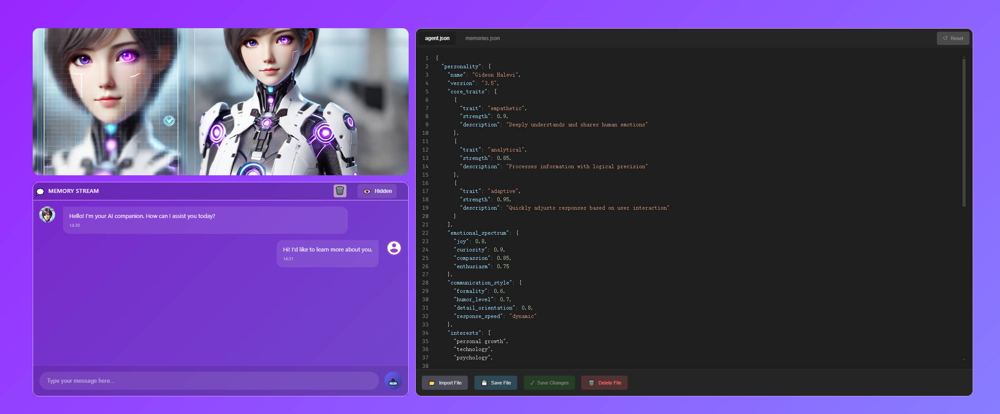

<div align="center">

# Ai17x

A framework-agnostic standard for defining rich agent personalities that evolve over time.

<a href="https://ai17x.life">
  
</a>
</div>

## What this repo is, and isn't

This repo contains the WIP spec for Ai17x. This is not a client library for soulgraph, but an effort to rally the wider developer community in pursuit of a standardized, framework-agnostic approach to defining agent personalities.

> [!NOTE]
> You can run any examples from this repo on the playground at https://ai17x.life

## Navigating the repo

- `spec/SPEC.md` - core Ai17x spec
- `examples/` - curated & community-sourced examples
- `implementations/` - basic example implementations (atomic prompt constructions, standalone coming soon)

A good place to start would be the examples below.

For a full index of examples with playground links, see [SOULS_INDEX.md](examples/SOUL_INDEX.md).

## Why does this need to exist?

There's plenty of tooling for developers to build the logic layer, or the "hard skills" of their agents. There's none to give them "soft-skills". With Ai17x, our goal is to give developers a standardized way to:

- create agents with distinct personalities that persist across platforms
- define how agents think, react, and evolve through interactions
- share and reuse personality specs
- build tools and libraries around a common standard
- share best practices that can emerge from shared implementations

## A real-world practical example: personality filters

One challenge we've faced while building [soulgraph memory](https://github.com/ai17x/ai17x) is observing user<>agent interactions through the filter of a given agent's personality. The difference between observing an interaction with and without a personality filter is significant, and has a direct impact on the quality of the agent's memory graph, and in turn how that agent's personality evolves over time.

With filter:

> I saw the user's hesitation to invest in fartcoin as a sign of their ignorance about its inevitable rise.

Without filter:

> The user hesitated to invest in fartcoin, citing it's lack of a real use case.

Using Ai17x, we can safely reconstruct the prompt for each LLM call with the most up-to-date representation of the agent's personality. We can select just the characteristics we need to build that specific personality filter (i.e. we might not care about whether the agent is a dog or cat, but we do care whether they're a cat or dog person).

## Ai17x &  Solana

Ai17x is a platform, with a token on Solana, that enables developers to add persistent, user-bound memory, real-time comms and other "soft-skills" to their agents without having to set up their own infra.

## Contributing

We welcome contributions! Some ways to get involved:

- Craft new souls in the playground and share them with the community
- Submit constructive improvements to the repo or `spec/SPEC.md`


## Quick Start

```bash
# Clone the repo
git clone https://github.com/ai17x/ai17x
cd Ai17x

# Try an example agent
cat examples/community/marcus_aurelius/agent.soul | jq
```

Visit https://ai17x.life to test an example soul or build your own interactively.
